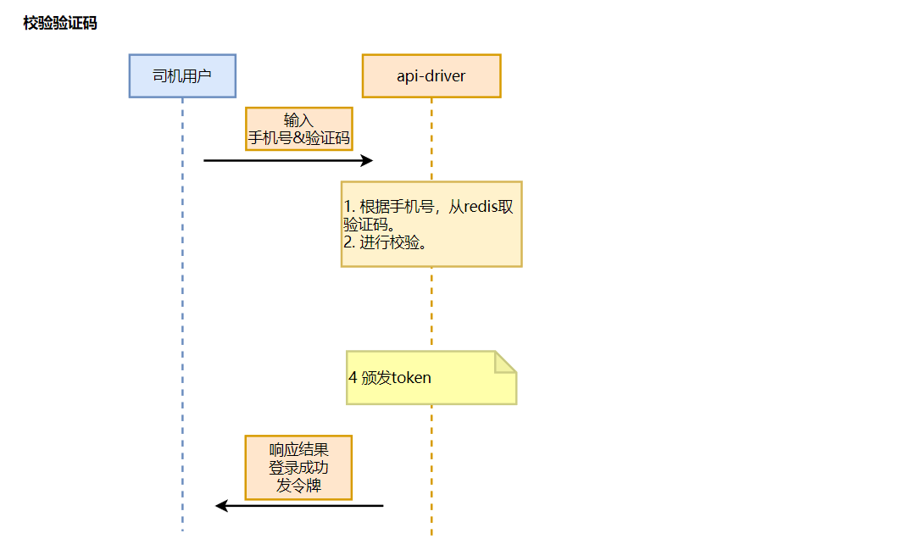

## 移动端司机信息
###### 创建移动端司机信息服务
1. 配置pom文件
2. api-driver服务注册到Nacos
3. 根据手机号调用service-driver-user和verification-code服务生成6位数验证码，存入到redis中
4. 司机登录校验token 
5. 司机根据手机号和验证码校验token
6. 司机端校验accessToken，在api-driver服务添加interceptor拦截器和jwt拦截器，进行token令牌的校验
```java
  public class JwtInterceptor implements HandlerInterceptor {

  @Resource
  private StringRedisTemplate stringRedisTemplate;

  @Override
  public boolean preHandle(HttpServletRequest request, HttpServletResponse response, Object handler) throws Exception {
  boolean result = true;
  String resultString = "";
  String token = request.getHeader("Authorization");

  //解析token
  TokenResult tokenResult = JwtUtils.checkToken(token);
    if(tokenResult == null){
       resultString = "access token invalid";
            result = false;
        }else {
            //拼接key
            String passengerPhone = tokenResult.getPassengerPhone();
            String identity = tokenResult.getIdentity();
            String tokenKey = RedisPrefixUtils.getByToken(passengerPhone, identity, TokenConstantEnum.ACCESS_TOKEN_TYPE);
            //从redis中取出accessToken进行校验
            String tokenRedis = stringRedisTemplate.opsForValue().get(tokenKey);
            if((StringUtils.isBlank(tokenRedis)) || (!token.trim().equals(tokenRedis.trim()))){
                 resultString = " access token invalid";
                 result = false;
            }
        }
        // 传入的token与从redis中取出的token进行比较是否相等
        if(!result){//如果result为false，就把错误写出去
            PrintWriter out = response.getWriter();
            out.print(JSONObject.fromObject(ResponseResult.fail(resultString)).toString());
        }
       return result;
    } 
  }
```
interceptor拦截器
```java
/**
 * 拦截器
 */
@Configuration
public class InterceptorConfig implements WebMvcConfigurer {

    @Bean
    public JwtInterceptor jwtInterceptor(){//因为拦截器的执行是在bean初始化之前，所以先把拦截器注入到bean中进行初始化，验证token
        return new JwtInterceptor();
    }

    @Override
    public void addInterceptors(InterceptorRegistry registry) {
       registry.addInterceptor(jwtInterceptor())
               .addPathPatterns("/**")//拦截所有路径
               .excludePathPatterns("/noauthTest"); //不拦截的路径;
    }
}
```
7. api-driver调用service-driver-user服务，进行司机信息的修改
8. api-driver调用service-map服务，进行车辆位置轨迹点信息上传时先调用service-driver-user根据车辆ID查询车辆信息，然后根据车辆id上传车辆轨迹点
9. 