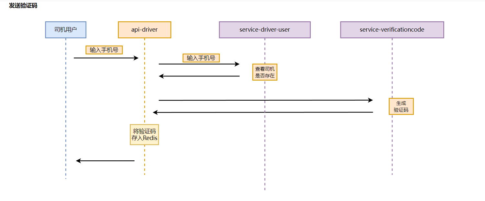
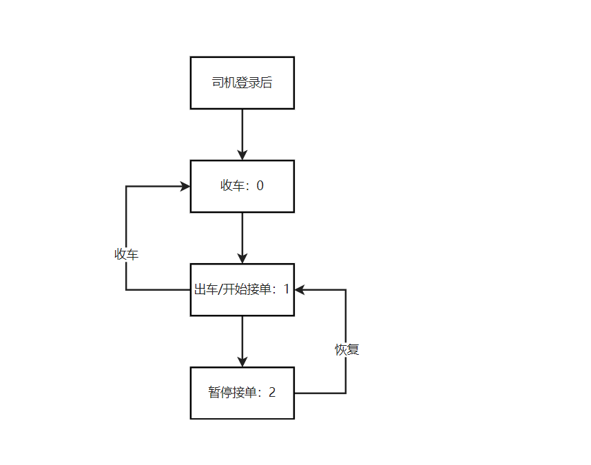

## 司机服务
1. 在service-map服务中梳理司机车辆时序图，创建司机服务
2. 创建service-driver-user服务，编写司机信息服务代码骨架
3. 编写插入司机信息代码和接口(/users)
4. 创建修改司机信息接口，编写修改司机信息代码
5. 添加车辆数据库，并设计相关接口
6. 添加司机车辆绑定关系表
7. 创建司机车辆绑定与解绑接口
8. 编写相关代码，需考虑到一辆车只能绑定一个司机，所以当车辆或者司机被绑定时，该车辆与司机都不能再重复被绑定
9. ```java
   // 判断，如果参数中的车辆和司机已经做过绑定，则不允许重复绑定
        QueryWrapper<DriverCarBindingRelationship> wrapper = new QueryWrapper<>();
        wrapper.eq("driver_id",descriptor.getDriverId())
                .eq("car_id",descriptor.getCarId())
                .eq("bind_state",DriverCarConstants.DRIVER_CAR_BIND);
        Integer integer = driverCarBindingRelationshipMap.selectCount(wrapper);
        if((integer > 0)){
            return ResponseResult.fail(CommonStatusEnum.DRIVER_CAR_BIND_EXITS.getCode(),
                    CommonStatusEnum.DRIVER_CAR_BIND_EXITS.getValue());
        }
        // 车辆被绑定了
         wrapper = new QueryWrapper<>();
        wrapper.eq("car_id",descriptor.getCarId())
                .eq("bind_state",DriverCarConstants.DRIVER_CAR_BIND);
         integer = driverCarBindingRelationshipMap.selectCount(wrapper);
        if((integer > 0)){
            return ResponseResult.fail(CommonStatusEnum.CAR_BIND_EXITS.getCode(),
                    CommonStatusEnum.CAR_BIND_EXITS.getValue());
        }
        // 司机被绑定了
         wrapper = new QueryWrapper<>();
        wrapper.eq("driver_id",descriptor.getDriverId())
                .eq("bind_state",DriverCarConstants.DRIVER_CAR_BIND);
         integer = driverCarBindingRelationshipMap.selectCount(wrapper);
        if((integer > 0)){
            return ResponseResult.fail(CommonStatusEnum.DRIVER_BIND_EXITS.getCode(),
                    CommonStatusEnum.DRIVER_BIND_EXITS.getValue());
        }

        LocalDateTime now = LocalDateTime.now();
        descriptor.setBindingTime(now);
        descriptor.setBindState(DriverCarConstants.DRIVER_CAR_BIND);
        driverCarBindingRelationshipMap.insert(descriptor);
   ```
10. 编写司机与车辆解绑相关代码
11. 司机登录时序图
12. 在api-Driver服务编写发送验证码的代码
13. 在service-Driver-User中根据手机号查询当前用户是否存在
14. api-driver服务调用service-driver-user服务查询对应手机号的司机
15. api-driver服务调用service-verificationcode服务生成验证码，然后返回验证码到api-driver服务并存入到redis中。

16. 添加司机工作状态流程
17. 编写司机工作状态流程代码，然后再添加司机信息的时候默认添加当前司机的工作状态
18. 在进行插入车辆信息的时候调用service-map服务获取此车辆在高德猎鹰服务上对应的终端ID
19. 
   