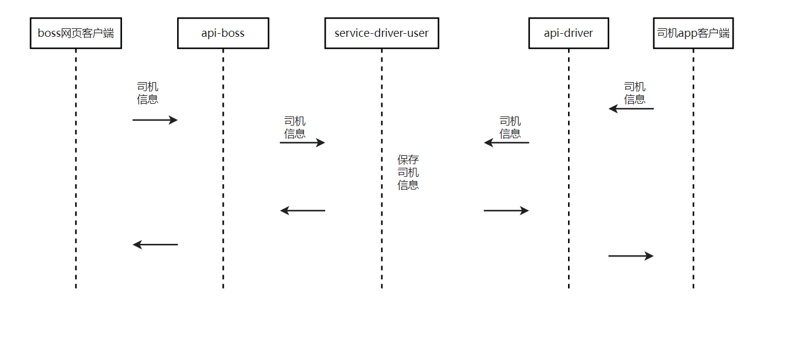
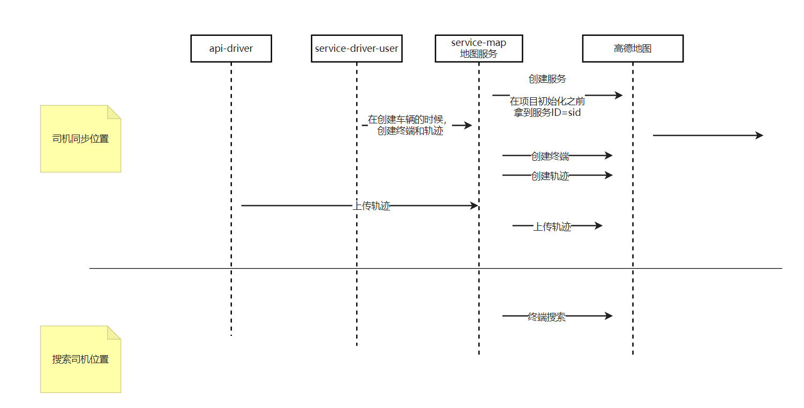

## 地图服务
1. 调用高德地图接口获取路径规划信息 AmapConfigConstant, MapDirectionClient
2. 计价服务调取地图服务,进行价格计价读取规则的代码编写，然后进行计算价格代码优化 ForecastPriceService,BigDecimalUtils
3. 创建地图服务，录入地区信息，创建对应的表
4. 创建行政区controller，然后拼接国家行政区代码的编写
5. 创建司机民族相关的数据库，然后创建民族字典表
6. 梳理司机车辆时序图

7. 设计司机表 driver-user,
## 司机位置管理
1. 司机位置时序图

### 轨迹服务创建
1. 创建轨迹服务
参考网址：https://lbs.amap.com/api/track/lieying-kaifa/api/service
2. 在Apifox中创建轨迹服务接口，进行测试

                "name": "test1",
                "sid": 951718

# 终端
    "data": {
        "name": "test1_02",
        "tid": 702601693,
        "sid": 951718
    },

        "trname": "test轨迹",
        "trid": 20