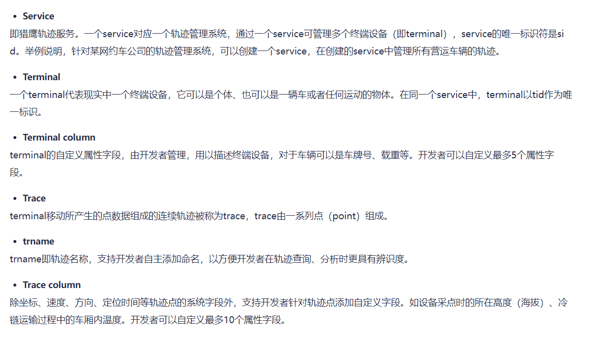

## 地图服务
1. 调用高德地图接口获取路径规划信息 AmapConfigConstant, MapDirectionClient
2. 计价服务调取地图服务,进行价格计价读取规则的代码编写，然后进行计算价格代码优化 ForecastPriceService,BigDecimalUtils
3. 创建地图服务，录入地区信息，创建对应的表
4. 创建行政区controller，然后拼接国家行政区代码的编写
5. 创建司机民族相关的数据库，然后创建民族字典表
6. 梳理司机车辆时序图

7. 设计司机表 driver-user,

### 轨迹服务创建
1. 创建轨迹服务
参考网址：https://lbs.amap.com/api/track/lieying-kaifa/api/service

2. 在Apifox中创建轨迹服务接口，进行测试
3. 服务创建初始化方法
   1. 在项目初始化之前创建轨迹服务获取sid，然后把sid填写到yml。方便其他服务调用，优点：提高效率，保证安全
   2. 创建项目之后，某个服务需要调用轨迹服务获取sid的时候，再创建轨迹服务进行获取，缺点：因为获取sid要先获取key，
   这样容易造成key泄密，不安全，优点：便于随用随创建。
4. 创建高德轨迹服务接口，编写调用高德接口代码开发
5. 创建高德终端管理接口，编写调用高德终端管理服务接口进行终端创建代码的编写与终端周边搜索的代码编写和响应的数据
```java
    /**
     * 终端周边搜索
     * @param center
     * @param radius
     * @return
     */
    public ResponseResult<List<TerminalResponse>> aroundsearch(String center, String radius){
        StringBuilder builder  = new StringBuilder();
        builder.append(AmapConfigConstants.AROUNDSERACH_URL)
                .append("?").append("key=").append(amapKey)
                .append("&")
                .append("sid=").append(Sid)
                .append("&")
                .append("center=").append(center)
                .append("&")
                .append("radius=").append(radius);
        log.info("搜索终端的请求："+builder.toString());
        ResponseEntity<String> responseEntity = restTemplate.postForEntity(builder.toString(), null, String.class);
        log.info("搜索终端的响应："+responseEntity.getBody());
        String body = responseEntity.getBody();
        JSONObject jsonObject = JSONObject.fromObject(body);
        JSONObject data = jsonObject.getJSONObject("data");
        JSONArray array = data.getJSONArray("results");
        List<TerminalResponse> list = new ArrayList<>();
        for (int i = 0; i < array.size(); i++) {
            TerminalResponse terminalResponse = new TerminalResponse();
            JSONObject arrayJSONObject = array.getJSONObject(i);
            String tid = arrayJSONObject.getString("tid");
            Long carId = arrayJSONObject.getLong("desc");
            terminalResponse.setCarId(carId);
            terminalResponse.setTid(tid);
            list.add(terminalResponse);

        }

        return ResponseResult.success(list);
    }
```
6. 创建高德轨迹接口，调用高德轨迹接口进行创建轨迹代码的编写
7. 创建车辆轨迹位置上传接口，调用高德轨迹上传接口进行车辆位置轨迹上传的代码编写，创建请求参数类PointRequest
~~~java
public ResponseResult upload(PointRequest pointRequest){
        // 获取高德猎鹰终端管理的创建终端的URL
        StringBuilder builder = new StringBuilder();
        builder.append(AmapConfigConstants.POINT_ADD_URL)
                .append("?").append("key=").append(amapKey)
                .append("&")
                .append("sid=").append(Sid)
                .append("&")
                .append("tid=").append(pointRequest.getTid())
                .append("&")
                .append("trid=").append(pointRequest.getTrid())
                .append("&")
                .append("points=");

        PointsDTO[] points = pointRequest.getPoints();
        builder.append("%5B");
        for (PointsDTO point : points) {
            builder.append("%7B");
            String location = point.getLocation();
            String locatetime = point.getLocatetime();
            builder.append("%22location%22")
                    .append("%3A")
                    .append("%22").append(location).append("%22")
                    .append("%2C")
                    .append("%22locatetime%22")
                    .append("%3A")
                    .append("%22").append(locatetime).append("%22");

            builder.append("%7D");
        }
        builder.append("%5D");

        System.out.println("车辆位置上传请求: "+builder.toString());
        ResponseEntity<String> responseEntity = restTemplate.postForEntity(URI.create(builder.toString()),
                null, String.class);
        String body = responseEntity.getBody();
       log.info("车辆位置上传响应数据"+body);

        return ResponseResult.success();

    }
~~~

## 总结
1. 司机位置时序图
   