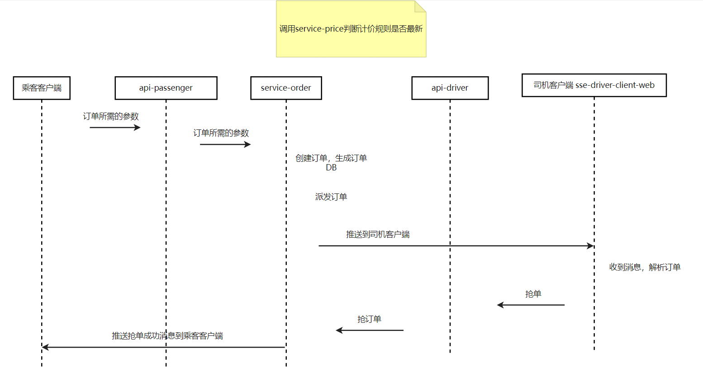

# 订单支付系统
### 乘客下订单时序图

1. 在api-passenger服务中编辑乘客下订单的接口设计
2. 创建service-order,并编写测试类进行测试
3. 创建订单表，使用代码生成工具类在service-order服务中生成相关代码
4. 在service-order服务中创建添加订单功能，因为要插入的值的属性与实体类orderinfo一样，所以引入beanutils方法
```java
@Service
public class OrderInfoService  {

    @Resource
    private OrderInfoMapper orderInfoMapper;

    /**
     * 创建订单
     * @param ordersRequest
     * @return
     */
    public ResponseResult addOrder(OrdersRequest ordersRequest)  {
        OrderInfo orderInfo = new OrderInfo();
        try {
            LocalDateTime now = LocalDateTime.now();
            /**
             * copyProperties(Object source, Object target)
             * source – 源bean 
             * target – 目标bean
             */
            BeanUtils.copyProperties(ordersRequest,orderInfo);
            orderInfo.setOrderStatus(OrdersConstants.ORDER_START);
            orderInfo.setGmtCreate(now);
            orderInfo.setGmtModified(now);
            orderInfoMapper.insert(orderInfo);
        } catch (Exception e) {
            throw new RuntimeException(e);
        }
        return ResponseResult.success();
    }

}
```
5. 在service-price服务中添加计价规则，编写添加计价规则代码，因为版本号默认从1开始，所以在每次添加时数据都相同的情况下都会让版本号加1，
为了避免造成生成大量废数据，在添加的同时进行判断，当计价规则没发生变化时，给与提示，有变化时进行数据的添加，这样可以看到历史数据。
```java
/**
     * 编辑计价规则
     * @param priceRule
     * @return
     */
    public ResponseResult edit(PriceRule priceRule){
        // 获取priceRule，然后拼接traceType
        String cityCode = priceRule.getCityCode();
        String vehicleType = priceRule.getVehicleType();
        String fareType = cityCode + "$" + vehicleType;
        priceRule.setFareType(fareType);

        // 插入默认版本号,先根据城市编码和车辆类型，由版本号信息分组降序查出当前版本的价格信息
        QueryWrapper<PriceRule> queryWrapper = new QueryWrapper<>();
        queryWrapper.eq("city_code",cityCode)
                .eq("vehicle_type",vehicleType)
                .orderByDesc("fare_version");
        List<PriceRule> priceRules = priceRuleMapper.selectList(queryWrapper);
        // 指定默认版本号
        int fareVersion = 1;

        // 判断查出的数据是否有值
        if (priceRules.size() > 0) {

            PriceRule rule = priceRules.get(0);
            Integer startMile = rule.getStartMile();
            Double startFare = rule.getStartFare();
            Double unitPricePerMile = rule.getUnitPricePerMile();
            Double unitPricePerMinute = rule.getUnitPricePerMinute();
            // 判断数据库的值与前端传来的值是否相等，若相等，则提示错误信息，否则更新数据库
            if (startMile.intValue() == priceRule.getStartMile().intValue()
            && startFare.doubleValue() == priceRule.getStartFare().doubleValue()
            && unitPricePerMile.doubleValue() == priceRule.getUnitPricePerMile().doubleValue()
            && unitPricePerMinute.doubleValue() == priceRule.getUnitPricePerMinute().doubleValue()
            ){
                return ResponseResult.fail(CommonStatusEnum.PRICE_RULE_NOT_EDIT.getCode(),
                        CommonStatusEnum.PRICE_RULE_NOT_EDIT.getValue());
            }

            fareVersion = rule.getFareVersion() + 1;
        }
        priceRule.setFareVersion(fareVersion);
        // 添加数据
        priceRuleMapper.insert(priceRule);

        return ResponseResult.success(" ");
    }
```
6. 在api-passenger服务中补全调用service-price服务的预估价格服务的代码，直接可以从数据库获取数据跟前端传入的数据进行确认并把值返回