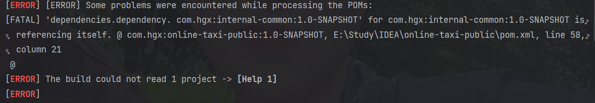

1. 因在打包过程中maven报错如下：

所以根据上述错误：调整项目的maven架构，把公共项目internal-common 从online-taxi-public中抽出来，让他俩变成平级
2. 发送验证码的类，有多个类使用，但有可能校验的参数不同，所以不能把这个类(VerificationCodeDTO)抽象到internal-comm中，需要分别在使用的项目中创建。
使用springboot的**validation**进行参数的校验